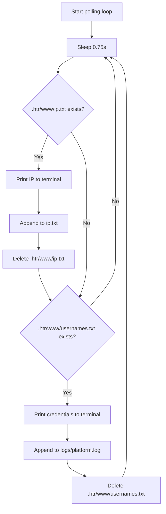

NexPhisher writes two categories of data during a session: credentials submitted through the phishing form and the IP addresses of visitors. Both are displayed in the terminal as they arrive and saved to disk for later review.

## Capture files (temporary)

When a victim interacts with the phishing page, PHP writes data to two files inside `.htr/www/`. These files are temporary — NexPhisher reads them, logs their contents to permanent storage, and deletes them so the polling loop can detect new submissions.

### `.htr/www/usernames.txt`

Created by the PHP form handler when a victim submits the login form.

```text
Username: victim@example.com
Pass: theirpassword
```

- Both fields are on separate lines with the `Username:` and `Pass:` prefixes.
- The file is deleted immediately after it is read.
- Subsequent form submissions create a new file, so multiple victims can be captured in one session.

### `.htr/www/ip.txt`

Created by `ip.php` when any visitor loads the phishing page.

```text
IP: 1.2.3.4
```

- The IP is recorded as soon as the page is loaded — before the victim submits any form.
- The file is deleted immediately after it is read.

## Persistent log files

After reading the temporary capture files, NexPhisher appends their contents to permanent log files on disk.

### `logs/<platform>.log`

One log file is created per platform per session. The file name matches the target platform chosen from the main menu.

**Location:** `logs/facebook.log`, `logs/instagram.log`, `logs/google.log`, etc.

**Format:**

```text
Username: victim@example.com
Pass: theirpassword
```

- New entries are appended to the existing file, so the log accumulates all credentials captured across multiple sessions for the same platform.
- The file is created automatically the first time credentials are captured for that platform.

### `ip.txt`

All victim IP addresses are appended to a single `ip.txt` file in the root NexPhisher directory, regardless of which platform was targeted.

**Location:** `ip.txt` (project root)

**Format:**

```text
IP: 1.2.3.4
IP: 203.0.113.22
```

Each session appends new entries to the same file.

## Summary of file locations

| File | Temporary | Persistent | Contents |
|------|-----------|------------|----------|
| `.htr/www/usernames.txt` | Yes | — | Raw credentials from current form submission |
| `.htr/www/ip.txt` | Yes | — | Raw IP from current page load |
| `logs/<platform>.log` | — | Yes | All credentials captured for that platform |
| `ip.txt` | — | Yes | All victim IPs across all sessions |

## The polling loop

The `datafound()` function runs an infinite `while [ true ]` loop for the duration of each session. It checks for both capture files every 0.75 seconds.



Both checks happen on every iteration. A single page load can trigger both the IP capture and (after form submission) the credential capture within the same loop cycle.

### Terminal output during capture

When an IP is detected:

```text
 [~] Victim IP Found !
 [~] Victim IP: 203.0.113.45
 [~] Saved: ip.txt
```

When credentials are detected:

```text
 [~] Login info Found !!
 [~] Account: victim@example.com
 [~] Password:  hunter2
 [~] Saved: logs/facebook.log

 [~] Waiting for Next Login Info, Ctrl + C to exit.
```

After printing, the tool returns to the polling loop and continues waiting for the next victim.

## The `.nexlink` file

`.nexlink` is a temporary file written to the project root during a session. It stores the public tunnel URL generated by Serveo or LocalXpose so that other parts of the script can read it without passing it as a variable.

- Created when a Serveo or LocalXpose tunnel starts.
- Read once to display the shareable URL in the terminal.
- Deleted by the `stop()` cleanup function when you press **Ctrl+C**.

<Note>
  If NexPhisher exits unexpectedly without running cleanup, `.nexlink` may remain on disk. You can safely delete it manually: `rm -f .nexlink`.
</Note>

## Viewing logs after a session

Logs are plain text files and can be read with any text viewer.

```bash
# View all credentials captured for Facebook
cat logs/facebook.log

# View all captured IP addresses
cat ip.txt

# List all platform log files that have been created
ls logs/
```

<Warning>
  Log files accumulate across sessions and are never cleared automatically. If you want to start fresh, delete the relevant log file or `ip.txt` manually before running a new session.
</Warning>
